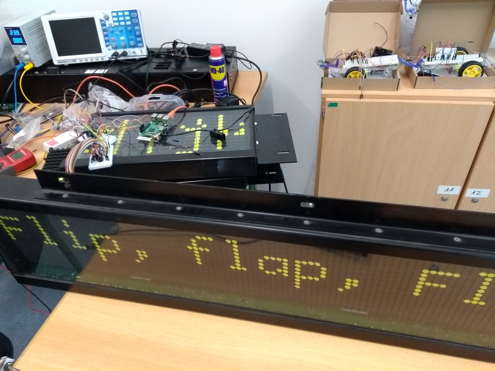

# flipflapflop
Steuerung einer Flipdot-Zielanzeige mit verschiedenen Mikrocontrollern.

 

In einem [Video bei YouTube](https://www.youtube.com/embed/a97wuYli1_Q) (oder bei 
[archive.org](https://archive.org/details/FlipFlapFlop)) wird das Display in Aktion gezeigt.

## FlipDotSim
FlipDotSim ist eine Klasse zur Simulation einer Flipdotanzeige. Dabei wird pygame verwendet. 
Ein Raspberry Pi wird nicht benötigt.
  
