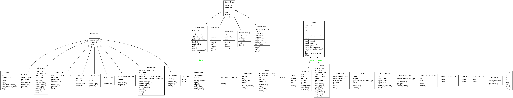

Developer Documentation
=======================

Find here information for developers of this project. If you just want
to use the package you don't need to read any further.

Deployment
----------

Checkout the repository to ``/home/pi/flipflapflop``::

  $ cd /home/pi
  $ git clone https://github.com/tbs1-bo/flipflapflop.git

Having `poetry <https://python-poetry.org/>`_ installed, you can install the package 
and its dependencies::

  $ cd flipflapflop
  $ poetry install

The deployment scenario described here relies on a Raspberry Pi that acts as an 
access point. To setup a Pi this way you can follow the `instructions from raspberrypi.org 
<https://www.raspberrypi.org/documentation/configuration/wireless/access-point.md>`_. We
choose to give the Pi the IP4-address 10.0.0.1/8. The ethernet port can be connected directly or
via USB to a local net in order to make the Pi accessible for other scenarios.

The display will be connected to the Pi directly. On the Pi runs a systemd-service as described
in the `Raspberry Pi Documentation <https://www.raspberrypi.org/documentation/linux/usage/systemd.md>`_.
The service file :download:`flipflapflop.service <../deployment/flipflapflop.service>`
must be copied to ``/etc/systemd/system`` and can be started afterwards::

   $ sudo systemctl start flipflapflop.service

To enable the service for automatic startup during boot use the following command::

  sudo systemctl enable flipflapflop.service

The display server runs on the default port 10101 and can be configured further in 
:download:`displayserver_service.py <../displayserver_service.py>`. You can specify 
dimensions of the display as well as module configuration here.

Deployment Scripts
^^^^^^^^^^^^^^^^^^

There is a setup script :download:`deploy_rpi.sh <../deployment/deploy_rpi.sh>`
that configures the Pi and installs the necessary software.

The setup script :download:`deploy_openwrt.sh <../deployment/deploy_openwrt.sh>` 
will setup the software to run on a OpenWRT OS.

Creating the documentation
--------------------------

The documentation is made with `Sphinx <http://www.sphinx-doc.org/>`_. 
Therefore the sphinx framework and a third party 
`theme from readthedocs <https://sphinx-rtd-theme.readthedocs.io>`_ 
must be installed.

.. code-block:: bash

   $ pip install sphinx sphinx-rtd-theme

The documentation is created with sphinx and is configured in folder ``docgen``. 
You can use ``make html`` or ``make.bat html`` to create the docucmentation
in ``docgen/_build/html``. It will automaticall be copied to ``docs``.
After pushing to github it will be available 
`there <https://tbs1-bo.github.io/flipflapflop/>`_.

Class Diagram
-------------

The following diagram shows classes of the project.

Video Backups
-------------

The videos linked in this documentation are hosted by YouTube. There is a 
mirror of these videos at 
`archive.org <https://archive.org/details/FlipFlapFlop>`_.
