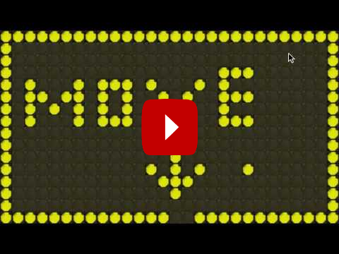

Games
=====

FlipDot-Displays can be used to play funny games on.

Rogueflip
---------

The demo game *rogueflip* is inspired by text-console based dungeon games 
named 'roguelike'. The following video shows the game in action.

Level Description
^^^^^^^^^^^^^^^^^

Each Level can be created with the `tiled map editor
<https://www.mapeditor.org/>`_. 
The map 
dimensions must be a multiple of the dimension of the flipdot display.

This :download:`example game world <../ressources/rogueflip_world.tmx>` can be 
opened with tiled using the following tileset. The tiles labeled P and C 
represent the player and a collectable coin respectively.

.. image:: ../ressources/rogueflip_tiles.jpg

An example world looks like the following.

.. image:: ../ressources/rogueflip_world.png

Module Description
^^^^^^^^^^^^^^^^^^

.. automodule:: rogueflip
   :members:
   :undoc-members:
   :exclude-members: test_roguegame
